## 参考书籍

[《x86汇编语言：从实模式到保护模式（第2版）》]()
[《操作系统真相还原》]()

## Vscode插件

> Name: ASM Code Lens
Id: maziac.asm-code-lens
Description: A language server that enables code lens, references, hover information, symbol renaming and the outline view for assembler files.
Version: 2.6.0
Publisher: maziac
VS Marketplace Link: https://marketplace.visualstudio.com/items?itemName=maziac.asm-code-lens

> Name: C/C++
Id: ms-vscode.cpptools
Description: C/C++ IntelliSense, debugging, and code browsing.
Version: 1.18.5
Publisher: Microsoft
VS Marketplace Link: https://marketplace.visualstudio.com/items?itemName=ms-vscode.cpptools

> Name: C/C++ Extension Pack
Id: ms-vscode.cpptools-extension-pack
Description: Popular extensions for C++ development in Visual Studio Code.
Version: 1.3.0
Publisher: Microsoft
VS Marketplace Link: https://marketplace.visualstudio.com/items?itemName=ms-vscode.cpptools-extension-pack

> Name: CMake Tools
Id: ms-vscode.cmake-tools
Description: Extended CMake support in Visual Studio Code
Version: 1.16.32
Publisher: Microsoft
VS Marketplace Link: https://marketplace.visualstudio.com/items?itemName=ms-vscode.cmake-tools

> Name: Hex Editor
Id: ms-vscode.hexeditor
Description: Allows viewing and editing files in a hex editor
Version: 1.9.12
Publisher: Microsoft
VS Marketplace Link: https://marketplace.visualstudio.com/items?itemName=ms-vscode.hexeditor

> Name: Markdown All in One
Id: yzhang.markdown-all-in-one
Description: All you need to write Markdown (keyboard shortcuts, table of contents, auto preview and more)
Version: 3.6.2
Publisher: Yu Zhang
VS Marketplace Link: https://marketplace.visualstudio.com/items?itemName=yzhang.markdown-all-in-one

> Name: NASM Language Support
Id: doinkythederp.nasm-language-support
Description: Language features for NASM Assembly
Version: 1.2.0
Publisher: doinkythederp
VS Marketplace Link: https://marketplace.visualstudio.com/items?itemName=doinkythederp.nasm-language-support

> Name: Remote - SSH: Editing Configuration Files
Id: ms-vscode-remote.remote-ssh-edit
Description: Edit SSH configuration files
Version: 0.86.0
Publisher: Microsoft
VS Marketplace Link: https://marketplace.visualstudio.com/items?itemName=ms-vscode-remote.remote-ssh-edit

> Name: Remote - SSH: Editing Configuration Files
Id: ms-vscode-remote.remote-ssh-edit
Description: Edit SSH configuration files
Version: 0.86.0
Publisher: Microsoft
VS Marketplace Link: https://marketplace.visualstudio.com/items?itemName=ms-vscode-remote.remote-ssh-edit

> Name: Makefile Tools
Id: ms-vscode.makefile-tools
Description: Provide makefile support in VS Code: C/C++ IntelliSense, build, debug/run.
Version: 0.8.22
Publisher: Microsoft
VS Marketplace Link: https://marketplace.visualstudio.com/items?itemName=ms-vscode.makefile-tools

## 汇编

### nasm 编译命令
    nasm -f bin boot.asm -o boot.bin

### 条件转移指令

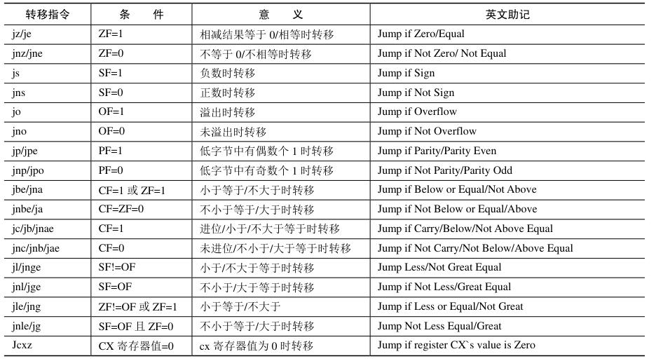

### ASCII表

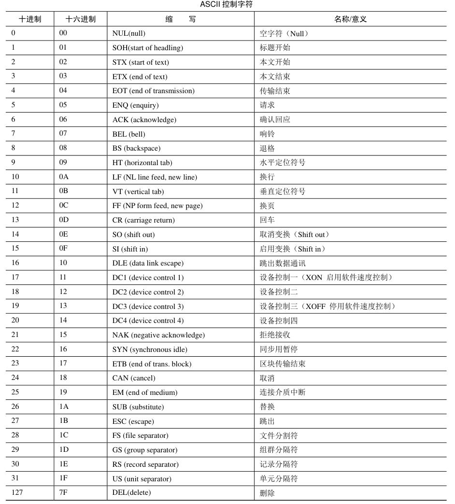
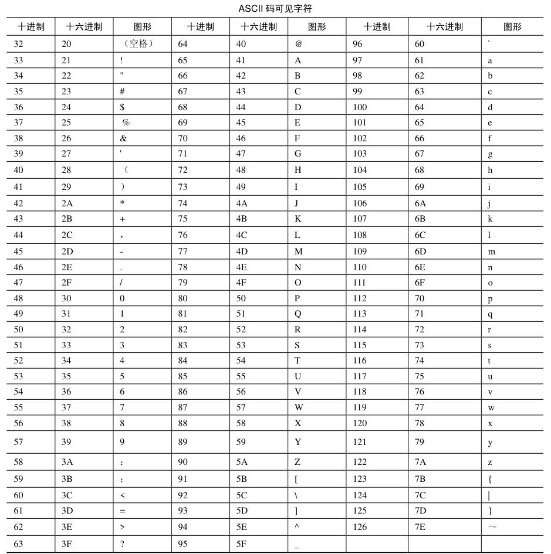

## 开发环境配置

### GIT

[linux下连接github](https://www.cnblogs.com/woider/p/6533709.html)
[端口代理](https://ericclose.github.io/git-proxy-config.html)
[DNS污染解决](https://zhuanlan.zhihu.com/p/521340971)

### 创建硬盘镜像

> [When you run bximage without one of the following options, it will appear in interactive mode and ask for all required parameters to manipulate an image.](https://manpages.debian.org/testing/bximage/bximage.1.en.html)

> **-func=...**
Operation to perform (create, convert, resize, commit, info)
**-fd=...**
Create: floppy image with size code (e.g. 360k, 720k, 1.44M)
**-hd=...**
Create/resize: hard disk image with size in megabytes (M) or gigabytes (G)
**-imgmode=...**
Create/convert: hard disk image mode - see the bochsrc sample for supported options.
**-b**
Convert/resize: create a backup of the source image. Commit: create backups of base image and redolog file.
**-q**
Quiet mode (don't prompt for user input). Without this option bximage uses the command line parameters as defaults for the interactive mode. If this option is given and one of the required parameters is missing, bximage will fall back to interactive mode.
**--help**
Print a summary of the command line options for bximage and exit.

理论上命令按照上文引用, 实际操作命令建议使用``bximage --help``查看

创建硬盘镜像

    bximage -q -hd=16 -mode=create -imgmode=flat master.img

将 boot.bin 写入主引导扇区

    dd if=boot.bin of=master.img bs=512 count=1 conv=notrunc

### 配置 bochs

    ata0-master: type=disk, path="master.img", mode=flat

### bochsrc

```ini
# configuration file generated by Bochs
plugin_ctrl: unmapped=1, biosdev=1, speaker=1, extfpuirq=1, parallel=1, serial=1, iodebug=1
config_interface: textconfig
display_library: x, options="gui_debug"
memory: host=32, guest=32
romimage: file="/usr/local/share/bochs/BIOS-bochs-latest", address=0x0, options=none
vgaromimage: file="/usr/local/share/bochs/VGABIOS-lgpl-latest"
boot: disk
floppy_bootsig_check: disabled=0
# no floppya
# no floppyb
ata0: enabled=1, ioaddr1=0x1f0, ioaddr2=0x3f0, irq=14
ata0-master: type=disk, path="master.img", mode=flat
ata0-slave: type=none
ata1: enabled=1, ioaddr1=0x170, ioaddr2=0x370, irq=15
ata1-master: type=none
ata1-slave: type=none
ata2: enabled=0
ata3: enabled=0
optromimage1: file=none
optromimage2: file=none
optromimage3: file=none
optromimage4: file=none
optramimage1: file=none
optramimage2: file=none
optramimage3: file=none
optramimage4: file=none
pci: enabled=1, chipset=i440fx
vga: extension=vbe, update_freq=5, realtime=1
cpu: count=1, ips=4000000, model=bx_generic, reset_on_triple_fault=1, cpuid_limit_winnt=0, ignore_bad_msrs=1, mwait_is_nop=0
cpuid: level=6, stepping=3, model=3, family=6, vendor_string="GenuineIntel", brand_string="              Intel(R) Pentium(R) 4 CPU        "
cpuid: mmx=1, apic=xapic, simd=sse2, sse4a=0, misaligned_sse=0, sep=1, movbe=0, adx=0
cpuid: aes=0, sha=0, xsave=0, xsaveopt=0, smep=0, smap=0, mwait=1
print_timestamps: enabled=0
debugger_log: -
magic_break: enabled=0
port_e9_hack: enabled=0
private_colormap: enabled=0
clock: sync=none, time0=local, rtc_sync=0
# no cmosimage
# no loader
log: -
logprefix: %t%e%d
debug: action=ignore
info: action=report
error: action=report
panic: action=ask
keyboard: type=mf, serial_delay=250, paste_delay=100000, user_shortcut=none
mouse: type=ps2, enabled=0, toggle=ctrl+mbutton
speaker: enabled=1, mode=system
parport1: enabled=1, file=none
parport2: enabled=0
com1: enabled=1, mode=null
com2: enabled=0
com3: enabled=0
com4: enabled=0
```

### 配置QUEM

> 从 qemu 7.0.0 更新开始我们用元包（meta package）将它拆包成了更细分的打包。

- qemu包现在是被元包 ``qemu-base``, ``qemu-desktop`` 和 ``qemu-full`` 提供的虚包。
- 7.0.0之前的qemu包的功能现在被``qemu-desktop``代替。
- ``qemu-headless``包的功能现在被``qemu-base``代替。
- ``qemu-arch-extra``包和``qemu-headless-arch-extra``包的功能现在被``qemu-emulators-full``代替。
- 元包``qemu-full``包提供所有 QEMU 相关的包（除了``qemu-guest-agent``)


安装QUEM

    sudo pacman -S qemu-full

If can`t open shared files libcapstone.so

    sudo pacman -S 
Exit QUEM Windows

    Ctrl + Alt + G

## 实模式

### 8086寻址方式

实际地址 = 段地址 << 4 + 偏移地址

### 古老的INTEL 8086处理器

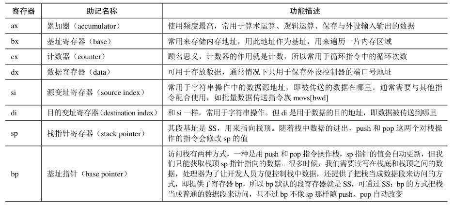

◆ 数据段可以起始于内存中的任何位置

◆ 为了让你写的程序在卖给别人之后，可以在内存中的任何地方正确执行，就只能在编写程序的时候使用相对地址或者逻辑地址，而不能使用真实的物理地址。当加载程序时，这些相对地址还要根据程序实际被加载的位置重新计算。

◆ 为了在硬件一级提供对“段地址:偏移地址”内存访问模式的支持，处理器至少要提供两个段寄存器，分别是代码段寄存器(Code Segment, CS)和数据段寄存器(Data Segment, DS)。

◆ CS是代码段寄存器，DS是数据段寄存器，ES是附加段(Extra Segment)寄存器。附加段的意思是，它是额外赠送的礼物，当需要在程序中同时使用两个数据段时，DS指向一个，ES指向另一个。可以在指令中指定使用DS和ES中的哪一个，如果没有指定，则默认使用DS。SS是栈段(Stack Segment)寄存器

◆ IP是指令指针(Instruction Pointer)寄存器，它只和CS一起使用，而且只有处理器才能直接改变它的内容。当一段代码开始执行时，CS保存代码段的段地址，IP则指向段内偏移。这样，由CS和IP共同形成逻辑地址，并由总线接口部件变换成物理地址来取得指令。然后，处理器会自动根据当前指令的长度来改变IP的值，使它指向下一条指令。

◆ **段只能起始于那些能够被16整除的物理内存地址**。对8086处理器来说，将这样的内存地址除以16或者右移4位，得到的结果就是逻辑段地址，简称段地址。要访问一个段，需要将段地址传送到段寄存器。

◆ 每个段正好16字节，偏移地址从0000H到000FH。

◆ 同样在不允许段之间重叠的情况下，每个段的最大长度是64KB，因为偏移地址也是16位的，从0000H到FFFFH。在这种情况下，1MB的内存，最多只能划分成16个段，每段长64KB，段地址分别是0000H、1000H、2000H、3000H，…，F000H。

◆ 段地址的选择取决于内存中哪些区域是空闲的。举个例子来说，假如从物理地址00000H开始，一直到82251H处都被其他程序占用着，而后面一直到FFFFFH的地址空间都是自由的，那么，你可以从物理内存地址82251H之后的地方加载你的程序。

◆ **8086处理器的逻辑分段，起始地址都是16的倍数，这称为是按16字节对齐的**。

◆ 段的划分是自由的，它可以起始于任何16字节对齐的内存地址，也可以是任意长度，只要不超过64KB。

### 8086内存分布

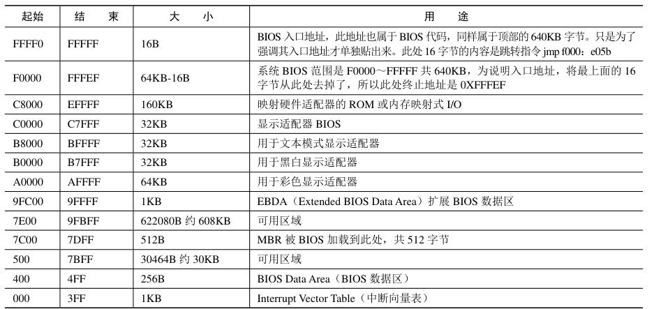

### 主引导扇区

◆ 一个有效的主引导扇区，其最后2字节的数据必须是0x55和0xAA。

◆ 在INTEL处理器上，将一个字写入内存时，是采用低端字节序的，低字节0x55置入低地址端（在前），高字节0xAA置入高地址端（在后）。

## 显卡

◆ 8086可以访问1MB内存。其中，0x00000～9FFFF属于常规内存，由内存条提供；0xF0000～0xFFFFF由主板上的一个芯片提供，即ROM-BIOS。这样一来，中间还有一个320KB的空洞，即0xA0000～0xEFFFF。传统上，这段地址空间由特定的外围设备来提供，其中就包括显卡。

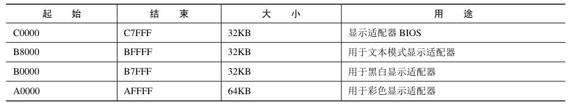

◆ 一直以来，0xB8000～0xBFFFF这段物理地址空间，是留给显卡的，由显卡来提供，用来显示文本。

◆ 为了访问显存，也需要使用逻辑地址，也就是采用“段地址:偏移地址”的形式，这是处理器的要求。考虑到文本模式下显存的起始物理地址是0xB8000，这块内存可以看成段地址为0xB800，偏移地址从0x0000延伸到0xFFFF的区域，因此我们可以把段地址定为0xB800。

### 字符颜色

◆ 屏幕上的每个字符对应着显存中连续2字节，前一个是字符的ASCII代码，后面是字符的显示属性，包括字符颜色（前景色）和底色（背景色）。

◆ 字符的显示属性（1字节）分为两部分，低4位定义的是前景色，高4位定义的是背景色。色彩主要由R、G、B这3位决定，毕竟我们知道，可以由红(R)、绿(G)、蓝(B)三原色来配出其他所有颜色。K是闪烁位，为0时不闪烁，为1时闪烁；I是亮度位，为0时正常亮度，为1时呈高亮。表6-2给出了背景色和前景色的所有可能值。

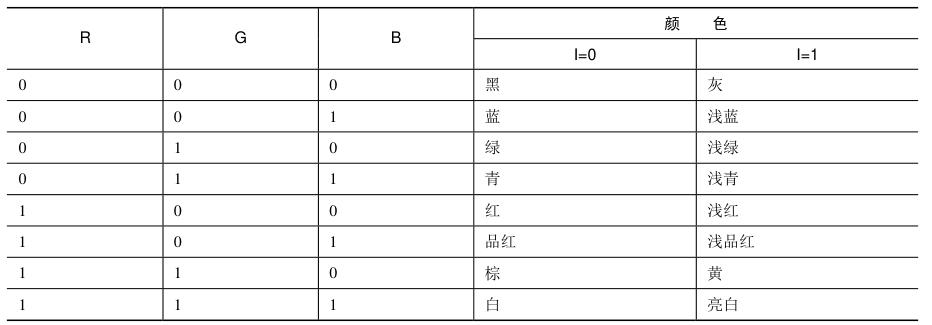

## 硬盘

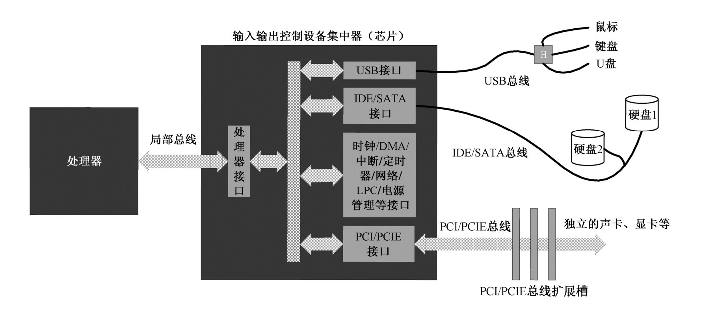

### 背景知识

◆ 在硬盘上，数据的访问是以柱面来组织的。

◆ ROM-BIOS将读取硬盘主引导扇区的内容，将它加载到内存地址0x0000:0x7c00（也就是物理地址0x07C00），然后用一个jmp指令跳到那里接着执行

◆ 物理地址0x0FFFF以下，是加载器及其栈的势力范围；物理地址A0000以上，是BIOS和外围设备的势力范围，有很多传统的老式设备将自己的存储器和只读存储器映射到这个空间。

◆ **输入输出控制设备集中器(I/O Controller Hub, ICH)芯片，该芯片的作用是连接不同的总线，并协调各个I/O接口对处理器的访问**。在个人计算机上，这块芯片就是所谓的南桥。

◆ 处理器通过局部总线连接到ICH内部的处理接口电路。然后，在ICH内部，又通过总线与各个I/O接口相连。在ICH内部，集成了一些常规的外围设备接口，如USB、PATA(IDE)、SATA、老式总线接口(LPC)、时钟等，这些东西对计算机来说必不可少，故直接集成在ICH内，我们后面还会详细介绍它们的功能。

◆ ICH还提供了对PCI或者PCI Express总线的支持，该总线向外延伸，连接着主板上的若干个扩展槽，就是刚才说的插槽。举个实例，如果你想连接显示器，那么就要先插入显卡，然后再把显示器接到显卡上。

◆ 处理器是通过端口(Port)来和外围设备打交道的。本质上，端口就是一些寄存器，类似于处理器内部的寄存器。不同之处仅仅在于，这些叫作端口的寄存器位于I/O接口电路中。

◆ PATA/SATA接口就有几个端口，分别是**命令端口**（当向该端口写入0x20时，表明是从硬盘读数据；写入0x30时，表明是向硬盘写数据）、**状态端口**（处理器根据这个端口的数据来判断硬盘工作是否正常，操作是否成功，发生了哪种错误）、**参数端口**（处理器通过这些端口告诉硬盘读写的扇区数量，以及起始的逻辑扇区号）和**数据端口**（通过这个端口连续地取得要读出的数据，或者通过这个端口连续地发送要写入硬盘的数据）。

◆ ICH芯片内部通常集成了两个PATA/SATA接口，分别是主硬盘接口和副硬盘接口。这样一来，主硬盘接口分配的端口号是0x1f0～0x1f7，副硬盘接口分配的端口号是0x170～0x177。

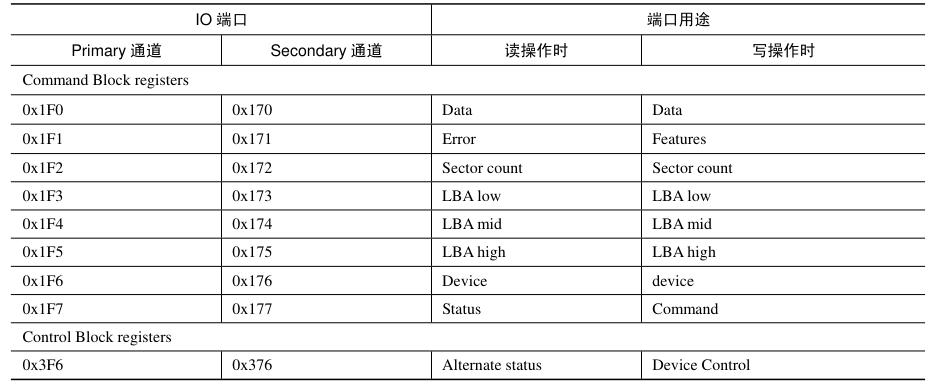

◆ 在INTEL的系统中，只允许65536（十进制数）个端口存在，端口号从0到65535(0x0000～0xffff)。因为是独立编址，所以，端口的访问不能使用类似于mov这样的指令，取而代之的是in和out指令。

◆ 硬盘读写的基本单位是扇区。就是说，要读就至少读一个扇区，要写就至少写一个扇区，不可能仅读写一个扇区中的几个字节。这样一来，就使得主机和硬盘之间的数据交换是成块的，所以硬盘是典型的**块设备**。

◆ 从硬盘读写数据，最经典的方式是向硬盘控制器分别发送磁头号、柱面号和扇区号（扇区在某个柱面上的编号），这称为**CHS模式**。

◆ 最早的逻辑扇区编址方法是LBA28，使用28比特来表示逻辑扇区号，从逻辑扇区0x0000000到0xFFFFFFF，共可以表示2`28=268435456个扇区。每个扇区有512字节，所以**LBA28可以管理128 GB的硬盘**。

◆ LBA48，采用48比特来表示逻辑扇区号。如此一来，就可以管理131072 TB的硬盘容量了。

◆ **个人计算机上的主硬盘控制器被分配了8位端口，端口号从0x1f0到0x1f7**。

### 硬盘读写


- 0x1F0：16bit 端口，用于读写数据
- 0x1F1：检测前一个指令的错误
- 0x1F2：读写扇区的数量
- 0x1F3：起始扇区的 0 ~ 7 位
- 0x1F4：起始扇区的 8 ~ 15 位
- 0x1F5：起始扇区的 16 ~ 23 位
- 0x1F6:
    - 0 ~ 3：起始扇区的 24 ~ 27 位
    - 4: 0 主盘, 1 从盘
    - 6: 0 CHS, 1 LBA
    - 5 ~ 7：固定为1
- 0x1F7: out
    - 0xEC: 识别硬盘
    - 0x20: 读硬盘
    - 0x30: 写硬盘
- 0x1F7: in / 8bit
    - 0 ERR
    - 3 DRQ 数据准备完毕
    - 7 BSY 硬盘繁忙

1. 第1步，设置要读取的扇区数量。这个数值要写入**0x1f2**端口。这是个8位端口，因此每次只能读写255个扇区
2. 第2步，设置起始LBA扇区号。扇区的读写是连续的，因此只需要给出第一个扇区的编号就可以了。28位的扇区号太长，需要将其分成4段，分别写入端口``0x1f3、0x1f4、0x1f5 和 0x1f6``。其中，``0x1f3``号端口存放的是0～7位；0x1f4号端口存放的是8～15位；0x1f5号端口存放的是16～23位，最后4位在0x1f6号端口。

> 在现行的体系下，每个PATA/SATA接口允许挂接两块硬盘，分别是主盘(Master)和从盘(Slave)。如图所示，0x1f6端口的低4位用于存放逻辑扇区号的24～27位，第4位用于指示硬盘号，0表示主盘，1表示从盘。高3位是“111”，表示LBA模式。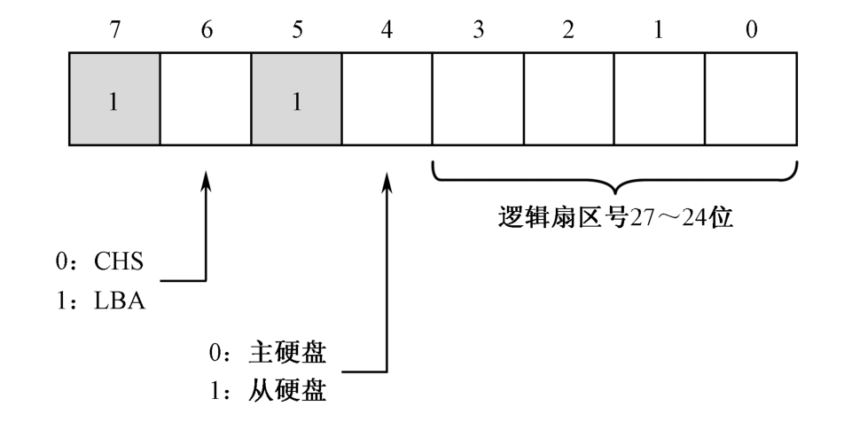

3. 第3步，向端口 ``0x1f7`` 写入0x20，请求硬盘读。
4. 第4步，等待读写操作完成。端口``0x1f7``既是命令端口，又是状态端口。在通过这个端口发送读写命令之后，硬盘就忙乎开了。在它内部操作期间，它将``0x1f7``端口的第7位置“1”，表明自己很忙。一旦硬盘系统准备就绪，它再将此位清零，说明自己已经忙完了，同时将第3位置“1”，意思是准备好了，请求主机发送或者接收数据。
5. 第5步，连续取出数据。``0x1f0``是硬盘接口的数据端口，而且还是一个16位端口。一旦硬盘控制器空闲，且准备就绪，就可以连续从这个端口写入或者读取数据。

## 内存

### 内存检测

◆ 在编写程序的时候，我们可以随时用指令来产生中断，这种类型的中断叫作**软中断**。软中断也不需要中断识别总线周期，中断号在指令中给出。

◆ int3是断点中断指令，机器指令码为0xCC。这条指令在调试程序的时候很有用，当程序运行不正常时，多数时候希望在某个地方设置一个检查点，也称断点，来查看寄存器、内存单元或者标志寄存器的内容，这条指令就是为这个目的而设的。

◆ int3和int 3是不同的指令，它们的机器码不同，前者是0xCC，后者是0xCD 0x03，但它们都会产生3号中断。换句话说，它们的中断处理过程是相同的。

◆ into是溢出中断指令，机器码为0xCE，也是单字节指令。当处理器执行这条指令时，如果标志寄存器的OF位是1，那么，将产生4号中断。否则，这条指令什么也不做。

◆ 最有名的**软中断是BIOS中断**，之所以称为BIOS中断，是因为这些中断功能是在计算机加电之后，BIOS程序执行期间建立起来的。换句话说，**这些中断功能在加载和执行主引导扇区之前**，就已经可以使用了。

◆ BIOS中断，又称BIOS功能调用，主要是为了方便地使用最基本的硬件访问功能。不同的硬件使用不同的中断号，比如，使用键盘服务时，中断号是0x16

 > BIOS 0x15 中断提供了丰富的功能，具体要调用的功能，需要在寄存器 ax 中指定。其中 0xE8xx 系列的子功能较为强大，0x15 中断的子功能 0xE820 和 0xE801 都可以用来获取内存，区别是 0xE820 返回的是内存布局，信息量相对多一些，操作也相对复杂。而 0xE801 直接返回的是内存容量，操作适中，不繁不简。上面还提到了子功能 0x88 也能获取内存容量，这是最简单的用法，不过操作越简单，功能也就越薄弱。

#### 利用 BIOS 中断 0x15 子功能 0xe820 获取内存

> BIOS 中断 0x15 的子功能 0xE820 能够获取系统的内存布局，由于系统内存各部分的类型属性不同，BIOS 就按照类型属性来划分这片系统内存，所以这种查询呈迭代式，每次 BIOS 只返回一种类型的内存信息，直到将所有内存类型返回完毕。子功能 0xE820 的强大之处是返回的内存信息较丰富，包括多个属性字段，所以需要一种格式结构来组织这些数据。内存信息的内容是用地址范围描述符来描述的，用于存储这种描述符的结构称之为地址范围描述符（Address Range Descriptor Structure，ARDS）


> 此结构中的字段大小都是 4 字节，共 5 个字段，所以此结构大小为 20 字节。每次 int 0x15 之后，BIOS就返回这样一个结构的数据。注意，ARDS 结构中用 64 位宽度的属性来描述这段内存基地址（起始地址）及其长度，所以表中的基地址和长度都分为低 32 位和高 32 位两部分。 其中的 Type 字段用来描述这段内存的类型，这里所谓的类型是说明这段内存的用途，即其是可以被操作系统使用，还是保留起来不能用。

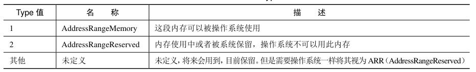

由于我们在 32 位环境下工作，所以在 ARDS 结构属性中，我们只用到低 32 位属性。``BaseAddrLow+LengthLow``是一片内存区域上限，单位是字节。

#### 具体操作流程

1. 填写好“调用前输入”中列出的寄存器。 
2. 执行中断调用 int 0x15。 
3. 在 CF 位为 0 的情况下，“返回后输出”中对应的寄存器便会有对应的结果。

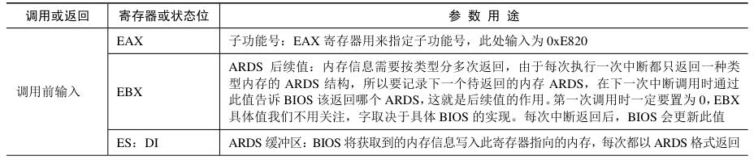

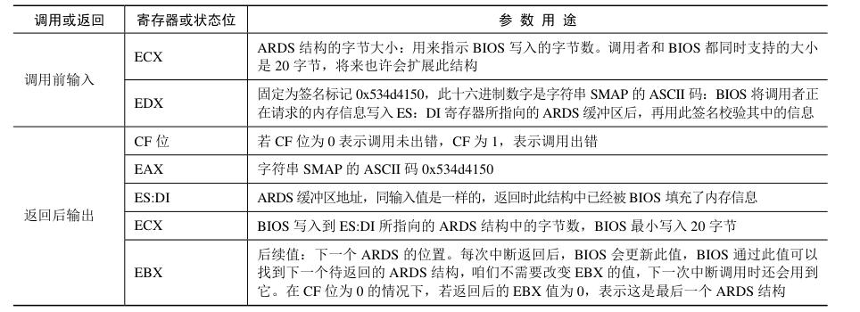

## 保护模式

### IA-32架构的基本执行环境

◆ 在16位处理器内，有8个通用寄存器AX、BX、CX、DX、SI、DI、BP和SP，其中，前4个还可以拆分成两个独立的8位寄存器来用，即AH、AL、BH、BL、CH、CL、DH和DL。

◆ 32位处理器在16位处理器的基础上，扩展了这8个通用寄存器的长度，使之达到32位。

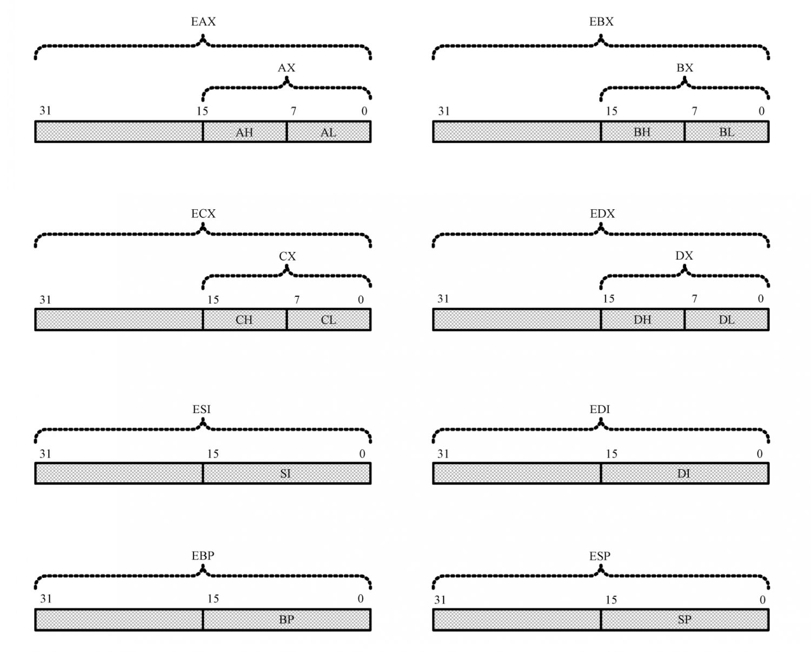

◆ 为了在汇编语言程序中使用经过扩展(Extend)的寄存器，需要给它们命名，它们的名字分别是EAX、EBX、ECX、EDX、ESI、EDI、ESP和EBP。

◆ 如果目的操作数是32位寄存器，源操作数是立即数，那么，立即数被视为32位的

◆ 32位通用寄存器的高16位是不可独立使用的，但低16位保持同16位处理器的兼容性。因此，在任何时候它们都可以像往常一样使用

◆ 可以在32位处理器上按照8086的实模式来运行，执行16位处理器上的软件。但是，它并不是16位处理器的简单增强。事实上，32位处理器有自己的32位工作模式，在本书中，32位模式特指32位保护模式。在这种模式下，可以完全、充分地发挥处理器的性能。同时，在这种模式下，处理器可以使用它全部的32根地址线，能够访问4GB内存。

◆ 在32位模式下，为了生成32位物理地址，处理器需要使用32位的指令指针寄存器。为此，32位处理器扩展了IP，使之达到32位，即EIP。当它工作在16位模式下时，依然使用16位的IP；工作在32位模式下时，使用的是全部的32位EIP。和往常一样，即使是在32位模式下，EIP寄存器也只由处理器内部使用，程序中是无法直接访问的。对IP和EIP的修改通常是用某些指令隐式进行的，此指令包括jmp、call、ret和iret等。

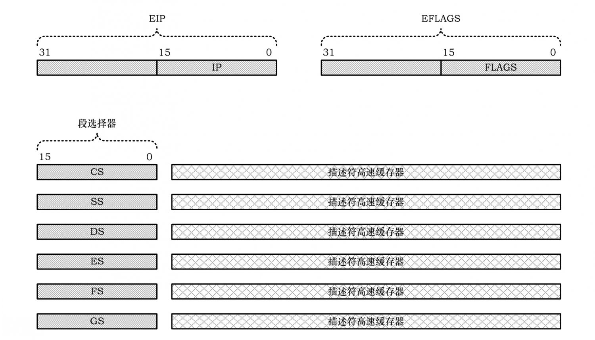

◆ 在32位模式下，对内存的访问从理论上来说不需要再分段，因为它有32根地址线，可以自由访问任何一个内存位置。但是，IA-32架构的处理器是基于**分段模型**的，因此，**32位处理器依然需要以段为单位访问内存**，即使它工作在32位模式下。

◆ 它也提供了一种变通的方案，即只分一个段，**段的基地址是0x00000000，段的长度（大小）是4GB**. 在这种情况下，可以视为不分段，即**平坦模型(Flat Mode)。**

◆ 每个程序都有属于自己的内存空间。在16位模式下，一个程序可以自由地访问不属于它的内存位置，甚至可以对那些地方的内容进行修改。这当然是不安全的，也不合法，但却没有任何机制来限制这种行为。**在32位模式下，处理器要求在加载程序时，先定义该程序所拥有的段，然后才允许使用这些段。**定义段时，除基地址（起始地址）外，还附加了段界限、特权级别、类型等属性。当程序访问一个段时，处理器将用固件实施各种检查工作，以防止对内存的违规访问。

◆ 在32位模式下，传统的段寄存器，如CS、SS、DS、ES，保存的不再是16位逻辑段地址，而是段的选择子，即用于选择所要访问的段，因此，这一部分也叫作段选择器。除段选择器外，每个段寄存器还包括一个不可见部分，称为**描述符高速缓存器**，里面有段的基地址和各种访问属性。这部分内容程序不可访问，由处理器自动使用。

◆ 32位处理器增加了两个额外的段寄存器FS和GS。

### 全局描述符表

◆ 在保护模式下，对内存的访问仍然使用段地址和偏移地址，但是，在每个段能够访问之前，必须先进行登记。

◆ 和一个段有关的信息需要8字节来描述，所以称为**段描述符(Segment Descriptor)**，每个段都需要一个描述符。为了存放这些描述符，需要在内存中开辟出一段空间。在这段空间里，所有的描述符都是挨在一起集中存放的，这就构成了一个描述符表。

◆ 最主要的描述符表是**全局描述符表(Global Descriptor Table, GDT)**，所谓全局，意味着该表是为整个软硬件系统服务的。在**进入保护模式前，必须要定义全局描述符表。**

◆ 为了跟踪全局描述符表，处理器内部有一个48位的寄存器，称为**全局描述符表寄存器(GDTR)**。该寄存器分为两部分，分别是32位的线性地址和16位的边界。32位的处理器具有32根地址线，可以访问的地址范围是0x00000000到0xFFFFFFFF，共232字节的内存，即4GB内存。所以，**GDTR的32位线性基地址部分保存的是全局描述符表在内存中的起始线性地址，16位边界部分保存的是全局描述符表的边界（界限），其在数值上等于表的大小（总字节数）减一。**

◆ 因为GDT的界限是16位的，所以，该表最大是216字节，也就是**65536字节**(64KB)。又因为一个描述符占8字节，故最多可以定义**8192个描述符**。实际上，不一定非得这么多，到底有多少，视需要而定，但最多不能超过8192个。

◆ 由于在实模式下只能访问1MB的内存，故GDT通常都定义在1MB以下的内存范围中。当然，允许在进入保护模式之后换个位置重新定义GDT。

### 段描述符

◆ 在实模式下，主引导程序的加载位置是0x0000:0x7c00，也就是物理地址0x07c00。因为现在的地址是32位的，所以它现在对应着物理地址0x00007c00。主引导扇区程序共512(0x200)字节，所以，我们决定把GDT设在主引导程序之后，也就是物理地址0x00007e00处。因为GDT最大可以为64KB，所以，理论上，它的尺寸可以扩展到物理地址0x00017dff处。

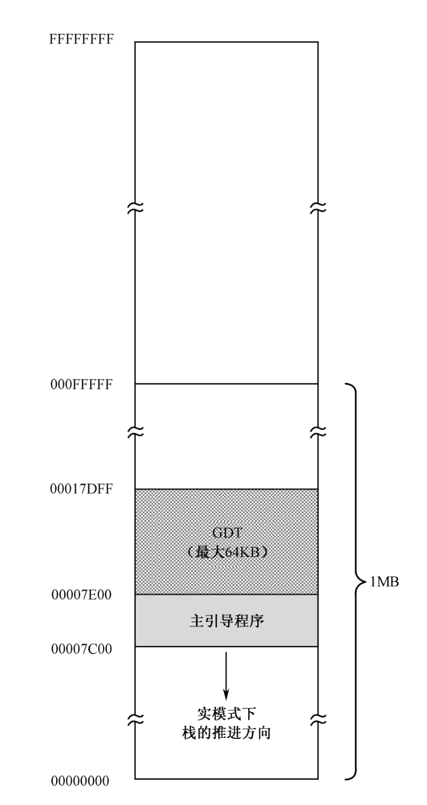

◆ 一旦确定了GDT在内存中的起始位置，下一步的工作就是确定要访问的段，并在GDT中为这些段创建各自的描述符。

◆ 每个描述符在GDT中占8字节，也就是2个**双字**，或者说是64位。图中，下面是低32位（低双字），上面是高32位（高双字）。

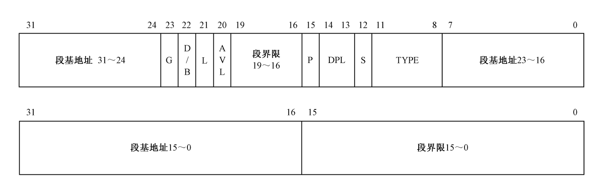　

◆ 描述符中指定了32位的段起始地址，以及20位的段边界。在实模式下，段地址并非真实的物理地址，在计算物理地址时，还要左移4位（乘以16）。和实模式不同，在32位保护模式下，段地址是32位的线性地址，如果未开启分页功能，该线性地址就是物理地址。

◆ 描述符中的段基地址和段界限不是连续的，把它们分成几段似乎不科学。但这也是没有办法的事，这是从80286处理器上带来的后遗症。80286也是16位的处理器，也有保护模式，但属于16位的保护模式。而且，其地址是24位的，允许访问最多16MB的内存。尽管80286的16位保护模式从来也没形成气候，但是，32位处理器为了保持同80286的兼容，只能在旧描述符的格式上进行扩充，这是不得已的做法。

◆ 段基地址可以是0～4GB范围内的任意地址，不过，还是建议应当选取那些16字节对齐的地址。

◆ **20位的段界限用来指定段的边界**，实际上也决定了段的大小。因为访问内存的方法是用段基地址加上偏移量，所以，这里有两种决定段大小的方法。一种是规定偏移量从0开始，那么偏移量的最大值就是段边界。这种方法适用于任何类型的段，包括代码段、数据段和栈段。另一种决定段大小的方法则正好相反，段内偏移量是从最大值开始往下递减的，而且这种方法是为栈段设计的。访问栈段时，取决于段描述符中的B位（马上就要讲到），可能使用SP，也可能使用ESP。如果是使用SP，段内偏移量的最大值是0xFFFF；如果是使用ESP，段内偏移量的最大值是0xFFFFFFFF。无论如何，对于这种段，描述符中的段界限就是段内不可使用的最小偏移量。

◆ **G位是粒度(Granularity)位**，用于解释段界限的含义。当G位**是“0”时**，段界限以**字节**为单位。此时，段的扩展范围是从1字节到1兆字节(1B～1MB)，因为描述符中的界限值是20位的。相反，如果该位**是“1”**，那么，段界限是以**4KB**为单位的。这样，段的扩展范围（段的大小）是从4KB到4GB。
**S位用于指定描述符的类型(Descriptor Type)**。当该位**是“0”时**，表示是一个**系统段**；**为“1”时**，表示是一个**代码段或者数据段**（栈段也是特殊的数据段）。系统段将在以后介绍。

◆ **DPL表示描述符的特权级(Descriptor Privilege Level, DPL)**共有4种处理器支持的特权级别，分别是0、1、2、3，其中0是最高特权级别，3是最低特权级别。

> 刚进入保护模式时执行的代码具有最高特权级0（可以看成从实模式那里继承来的），这些代码通常都是操作系统代码，因此它的特权级别最高。每当操作系统加载一个用户程序时，它通常都会指定一个稍低的特权级，比如3特权级。不同特权级别的程序是互相隔离的，其互访是严格限制的，而且有些处理器指令（特权指令）只能由0特权级的程序来执行，为的就是安全。

> 描述符的特权级用于指定要访问该段所必须具有的最低特权级。如果这里的数值是2，那么，只有特权级别为0、1和2的程序才能访问该段，而特权级为3的程序访问该段时，处理器会予以阻止。

◆ **P是段存在位(Segment Present)。**P位用于指示描述符所对应的段是否存在。一般来说，描述符所指示的段都位于**内存**中。

> P位是由处理器负责检查的。每当通过描述符访问内存中的段时，如果P位是“0”，处理器就会产生一个异常中断。通常，该中断处理过程是由操作系统提供的，该处理过程的任务是负责将该段从硬盘换回内存，并将P位置1。

◆ **D/B位是“默认操作尺寸”(Default Operation Size)或者“默认的栈指针尺寸”(Default Stack Pointer Size)**，又或者“上部边界”(Upper Bound)标志。设立该标志位，主要是为了能够在32位处理器上兼容运行16位保护模式的程序。尽管这种程序现在已经非常罕见了，但它毕竟存在过。

> 该标志位对不同的段有不同的效果。对于代码段，此位称作“D”位，用于指示指令中默认的有效地址和操作数尺寸。D=0表示指令中的有效地址或者操作数是16位的；D=1，指示32位的有效地址或者操作数。

> 对于栈段和向下扩展的数据段来说，该位被叫作“B”位，用于指定在进行隐式的栈操作时，是使用寄存器SP还是寄存器ESP，隐式的栈操作指令包括push、pop和call等。如果该位是“0”，在访问那个段时，使用寄存器SP，否则就是使用寄存器ESP。

> 对于向下扩展的段来说，如果B位是0，段的下部边界由前面所说的段界限确定，段的上部边界是0xFFFF；如果B位是1，段的下部边界也由前面所说的段界限确定，段的上部边界是0xFFFFFFFF。

◆ **L位是64位代码段标志(64-bit Code Segment)**，保留此位给64位处理器使用。目前，我们将此位置“0”即可。

◆ TYPE字段共4位，用于指示**描述符的子类型**，或者说是类别。如表12-1所示，对于数据段来说，这4位分别是X、E、W、A位；而对于代码段来说，这4位则分别是X、C、R、A位。

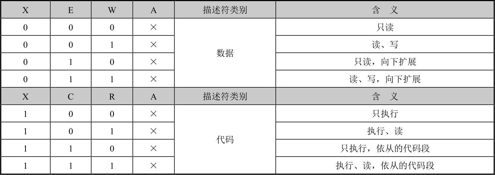

◆ **X表示是否可以执行(eXecutable)。**数据段总是不可执行的，X=0；代码段总是可以执行的，X=1。对于数据段来说，**E位指示段的扩展方向**。E=0是向上扩展的，也就是向高地址方向扩展的，是普通的数据段；E=1是向下扩展的，也就是向低地址方向扩展的，通常是栈段。

> 段的扩展方向和栈的推进方向不是一回事。栈始终是从高地址方向往低地址方向推进的，这一点没有改变。但是，可以使用向上扩展的段作为栈段，也可以使用向下扩展的段作为栈段。段的扩展方向仅仅用来决定段界限的含义，同时也决定了段内偏移量的范围。

◆ **W位指示段的读写属性**，或者说段是否可写，W=0的段是不允许写入的，否则会引发处理器异常中断；W=1的段是可以正常写入的。

◆ 对于代码段来说，**C位指示段是否为特权级依从的(Conforming)**。C=0表示非依从的代码段，这样的代码段可以从与它特权级相同的代码段调用，或者通过门调用；C=1表示允许从低特权级的程序转移到该段执行。

◆ **R位指示代码段是否允许读出。**代码段总是可以执行的，但是，为了防止程序被破坏，它是不能写入的。至于是否有读出的可能，由R位指定。R=0表示不能读出，如果企图去读一个R=0的代码段，会引发处理器异常中断；如果R=1，则代码段是可以读出的，即可以把这个段的内容当成ROM一样使用。

◆ 数据段和代码段的**A位是已访问(Accessed)位**，用于指示它所指向的段最近是否被访问过。在描述符创建的时候，应该清零。之后，每当该段被访问时，处理器自动将该位置“1”。

◆ **AVL是软件可以使用的位(Available)**，通常由操作系统来用，处理器并不使用它。如果你把它理解成“好吧，该安排的都安排了，最后多出这么一位，不知道干什么用好，就给软件用吧”，我也不反对，也许INTEL公司也不会说些什么。

### 安装存储器的段描述符并加载GDTR

◆ 处理器规定，GDT中的**第一个描述符**必须是**空描述符**，或者叫“哑描述符”、NULL描述符，相信后者对于有C语言经历的读者来说更容易接受。

◆ 描述符选择子包含了描述符在**描述符表中的序号**（索引号），如果选择的是GDT中的第一个描述符（0号描述符），则选择子为0。但是，一个未初始化的选择子往往也是0，使用这样的描述符将默认选择GDT中的0号描述符，但未必是我们的本意。因此，处理器要求将第一个描述符定义成空描述符。

◆ INTEL处理器是低端字节序的，所以低双字在低地址端，高双字在高地址端；低字在低地址端，高字在高地址端；低字节在低地址端，高字节在高地址端。

◆ 加载描述符表的线性基地址和界限到寄存器GDTR，这要使用``lgdt``指令

◆ lgdt指令从指定的内存地址处加载**6字节**的数据到寄存器GDTR，其中包括32位的GDT线性地址及16位的界限值。该指令在实模式和保护模式下都可以执行，但是在实模式下使用16位的有效地址m访问内存；在32位保护模式下使用32位的有效地址m访问内存。

◆ 在这6字节的内存区域中，要求前（低）16位是GDT的界限值，后（高）32位是GDT的基地址。在初始状态下（计算机启动之后），寄存器GDTR的基地址被初始化为0x00000000；界限值为0xFFFF。

◆ GDT的界限值是表的总字节数减去1

### A20

◆ 端口``0x92``的位1用于控制A20，叫作替代的A20门控制(Alternate A20 Gate, ALT_A20_GATE)，它和来自键盘控制器的A20控制线一起，通过或门连接到处理器的A20M#引脚。和使用键盘控制器的端口不同，通过0x92端口显得非常迅速，也非常方便快捷，因此称为Fast A20。当INIT_NOW从0过渡到1时，ALT_A20_GATE将被置“1”。这就是说，计算机启动时，第21根地址线是自动启用的。A20M#信号仅用于单处理器系统，多核处理器一般不用。特别是考虑到传统的键盘控制器正逐渐被USB键盘代替，这些老式设备也许很快就会消失。

### Cr0

◆ CR0是32位的寄存器，包含了一系列用于控制处理器操作模式和运行状态的标志位。如图12-8所示，它的第1位（位0）是保护模式允许位(Protection Enable, PE)，是开启保护模式大门的门把手，如果把该位置“1”，则处理器进入保护模式

### 寻址过程

◆ 在保护模式下，段寄存器CS、DS、ES、FS、GS和SS用作段选择器。在保护模式下，尽管访问内存时也需要指定一个段，但传送到段寄存器的内容不是逻辑段地址，而是段描述符在描述符表中的索引号。

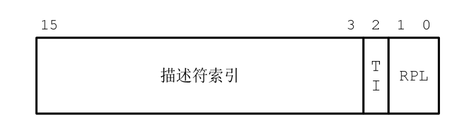

◆ 在保护模式下访问一个段时，传送到段寄存器的是**段选择子**。它由三部分组成，第一部分是描述符的索引号，用来在描述符表中选择一个段描述符。TI是描述符表指示器(Table Indicator)，TI=0时，表示描述符在GDT中；TI=1时，描述符在LDT中。LDT的知识将在后面进行介绍，它也是一个描述符表，和GDT类似。RPL是请求特权级，表示给出当前选择子的那个程序的特权级别，正是该程序要求访问这个内存段。每个程序都有特权级别，也将在后面慢慢介绍，现在只需要将这两位置成“00”即可。

◆ 当处理器在执行任何改变段选择器的指令时（比如pop、mov、jmp far、call far、iret、retf），就将**指令中提供的索引号乘以8作为偏移地址，同GDTR中提供的线性基地址相加，以访问GDT**。如果没有发现什么问题（比如超出了GDT的界限），就自动将找到的描述符加载到不可见的描述符高速缓存部分。

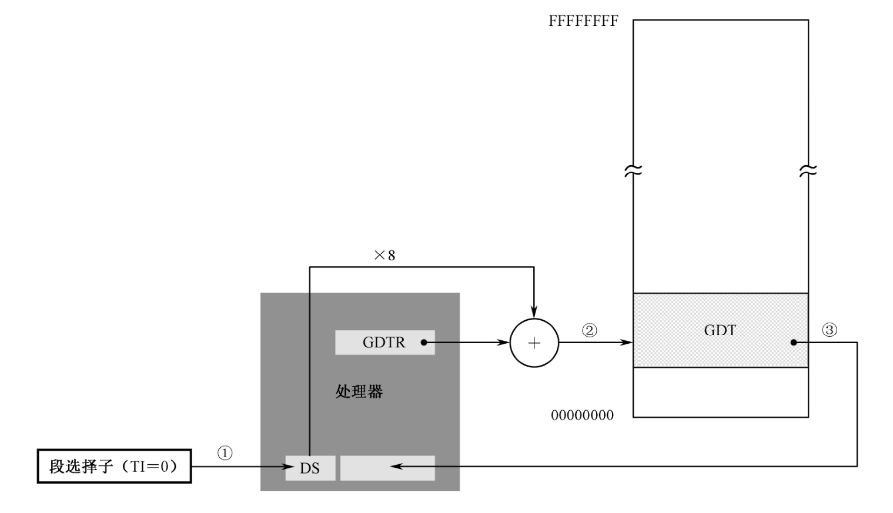

◆ 在32位处理器上，即使是在实模式下，在执行访问内存的指令时（包括取指令时）也并非是将逻辑段地址左移4位，加上指令中提供的有效地址。相反，它同样是用段描述符高速缓存器中的32位线性基地址加上指令中提供的有效地址。至于说段描述符高速缓存器中的基地址是怎么来的，那是在我们访问内存之前，通常要执行一条将逻辑段地址代入段寄存器的指令。此时，处理器将逻辑段地址左移4次，形成20位地址，左侧补0，补足32位后再传送到段描述符高速缓存器。此后，就直接使用这个32位的段地址访问内存（包括取指令）。

## 用户程序

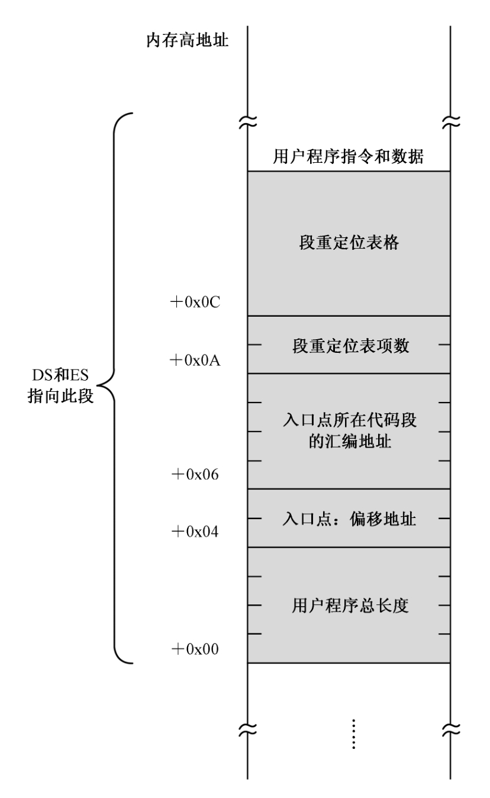

